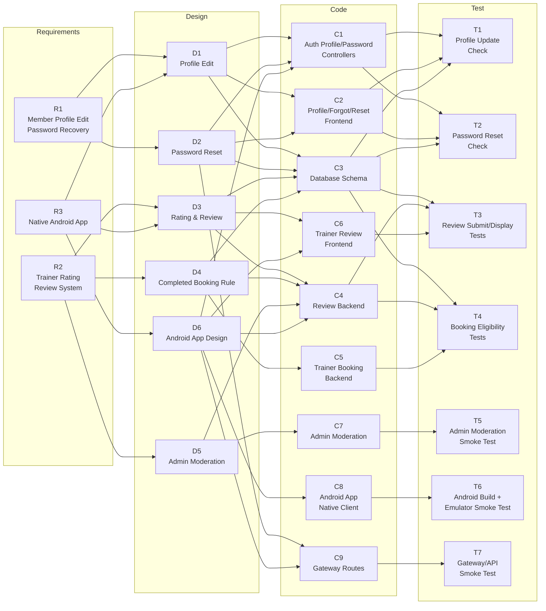
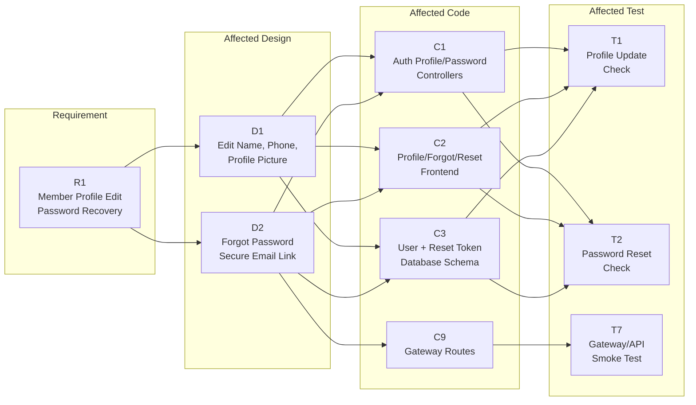
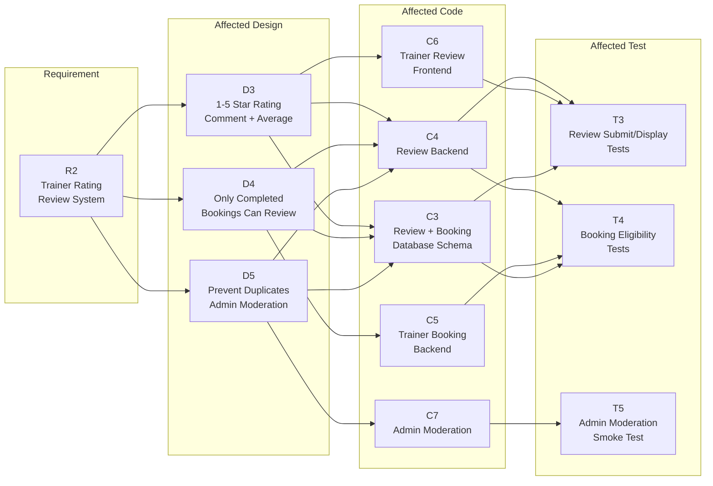
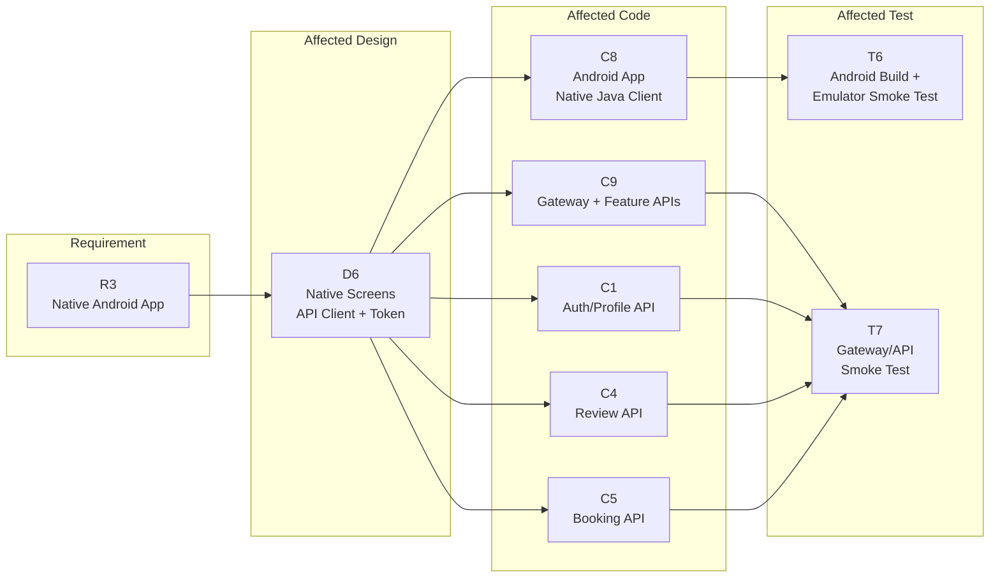
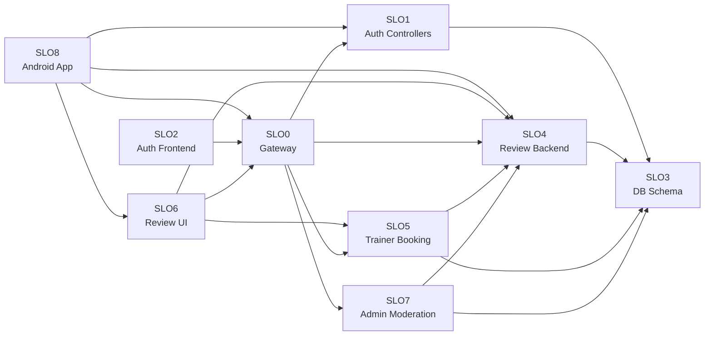

# D4: Impact Analysis

## 1. Scope

This impact analysis focuses only on the three required maintenance features:

| Requirement ID | Feature |
|---|---|
| R1 | Member Profile Edit and Password Recovery System |
| R2 | Trainer Rating and Review System |
| R3 | Native Android Mobile Application |

R1 and R2 are the Product Owner feature requests. R3 is included because the native Android app has been implemented as the mobile client for the maintained system.

## 2. Traceability Objects

### Requirements

| ID | Brief information |
|---|---|
| R1 | Members can update name, phone number, and profile picture. Members can also request a secure password reset link by email. |
| R2 | Members can rate trainers 1-5 stars and leave comments after a completed private training session. The system shows average ratings, prevents duplicates, and allows admin moderation. |
| R3 | A native Android app provides the main member features using the existing backend APIs. |

### Design Objects

| ID | Brief information |
|---|---|
| D1 | Profile edit design: editable name, phone number, profile picture, and saved profile display. |
| D2 | Password recovery design: forgot-password form, secure reset token, email link, and reset-password page. |
| D3 | Trainer review design: star rating, comment submission, average rating display, and duplicate prevention. |
| D4 | Review eligibility design: only members with completed private trainer bookings can review that trainer. |
| D5 | Admin moderation design: administrators can manage inappropriate review content. |
| D6 | Android app design: native navigation, API client, token storage, and feature screens for member workflows. |

### Code Objects

| ID | Brief information |
|---|---|
| C1 | AuthMembership profile/password backend controllers. |
| C2 | AuthMembership profile, forgot-password, reset-password, auth, and home frontend pages. |
| C3 | User, reset-token, review, and booking database schema support. |
| C4 | Course-service review controller, routes, and rating calculation logic. |
| C5 | Course-service trainer booking controller and completed-session checks. |
| C6 | Course-service trainer/profile/review frontend UI. |
| C7 | Admin service review moderation area. |
| C8 | Android app module with native Java screens, API client, and local session storage. |
| C9 | AuthMembership gateway routes used by web and Android clients. |

### Test Objects

| ID | Brief information |
|---|---|
| T1 | Profile update verification. |
| T2 | Password reset email and reset-link verification. |
| T3 | Trainer review submission and display tests. |
| T4 | Completed-booking review eligibility tests. |
| T5 | Admin review moderation smoke test. |
| T6 | Android Gradle build and emulator UI smoke test. |
| T7 | Gateway/API smoke test. |

## 3. Whole Software Traceability Graph

## 4. Affected Traceability Graphs

### 4.1 Feature Request 1: Member Profile Edit and Password Recovery System

Brief impact: this feature mainly affects the AuthMembership user management area. Profile edit is a medium-impact change because it updates saved member data. Password recovery is higher impact because it touches token security, email delivery, and reset-link correctness.

### 4.2 Feature Request 2: Trainer Rating and Review System

Brief impact: this feature mainly affects course-service trainer booking and review code. The difficult part is enforcing fairness: only completed bookings can create reviews, duplicate reviews must be blocked, and admin moderation must not break rating display.

### 4.3 Feature 3: Native Android Mobile Application

This feature is implemented in `android-app/` as a native Java Android client that calls the deployed backend APIs.

Brief impact: this feature has broad impact because Android reuses the same backend capabilities as the web app while adding a separate native UI layer. Changes to authentication, profile, course enrollment, trainer booking/review, payment, court reservation, or attendance endpoints can affect the Android client.

## 5. Directed SLO Graph

SLOs are code modules only.

| SLO | Code module |
|---|---|
| SLO0 | Gateway routes |
| SLO1 | Auth profile/password controllers |
| SLO2 | Auth/profile/forgot/reset frontend pages |
| SLO3 | Database schema for users, reset tokens, bookings, and reviews |
| SLO4 | Trainer review backend |
| SLO5 | Trainer booking backend |
| SLO6 | Trainer review frontend UI |
| SLO7 | Admin moderation module |
| SLO8 | Android app module |

## 6. Connectivity Matrix

The matrix shows shortest directed graph distances. `0` means the same module. `-` means no directed path.

| From / To | SLO0 | SLO1 | SLO2 | SLO3 | SLO4 | SLO5 | SLO6 | SLO7 | SLO8 |
|---|---:|---:|---:|---:|---:|---:|---:|---:|---:|
| SLO0 | 0 | 1 | - | 2 | 1 | 1 | - | 1 | - |
| SLO1 | - | 0 | - | 1 | - | - | - | - | - |
| SLO2 | 1 | 2 | 0 | 3 | 2 | 2 | - | 2 | - |
| SLO3 | - | - | - | 0 | - | - | - | - | - |
| SLO4 | - | - | - | 1 | 0 | - | - | - | - |
| SLO5 | - | - | - | 1 | 1 | 0 | - | - | - |
| SLO6 | 1 | 2 | - | 2 | 1 | 1 | 0 | 2 | - |
| SLO7 | - | - | - | 1 | 1 | - | - | 0 | - |
| SLO8 | 1 | 1 | - | 2 | 1 | 2 | 1 | 2 | 0 |

## 7. Change Difficulty Analysis

### Easy Changes

| Change | Why it is easier |
|---|---|
| Profile edit form and display | The change is mostly contained in AuthMembership frontend, AuthMembership controller, and user profile data. |
| Average trainer rating display | It mainly reads review data and calculates/display averages. It is less risky than accepting new review submissions. |
| Admin review removal smoke test | The expected behavior is simple: an admin removes inappropriate content and the review no longer appears. |

### Difficult Changes

| Change | Why it is difficult |
|---|---|
| Password recovery | It crosses frontend forms, backend token logic, database storage, email delivery, and public reset URLs. |
| Trainer review submission | It depends on member identity, completed trainer bookings, duplicate prevention, database persistence, and frontend state. |
| Completed-session validation | This rule is important for fairness, but it is difficult because review permission depends on booking status. |
| Android app | It is difficult because the native app must keep authentication, profile, course, trainer review, payment, court reservation, and attendance flows aligned with the deployed backend APIs. |

## 8. Expectations from Previous Developers

To make maintenance easier, previous developers should have provided:

- A traceability table connecting requirements, design, code modules, and tests.
- API documentation for profile update, password reset, trainer booking, and trainer review endpoints.
- Database schema notes for user profile fields, reset tokens, bookings, and reviews.
- Clear notes about which UI flows were mocked and which were connected to real persistence.
- Tests for profile update, password reset, trainer booking, review submission, duplicate review prevention, and admin moderation.

■ Which change requests are easy to apply and why?
- Change requests like trainer average rating display because it does not involve a logic that is too complex.
■ Which change requests are difficult to apply and why?
- Change requests like migrating backend to cloud due to the previous team did the local database, so we have to do many configurations by ourselves. Furthermore, some of the core functions are not properly implemented, just a hard-coded data. 
■ To make the maintenance easier, what would you expect from the
previous developers?
- We expected previous developers to have an ideal file structure and functional core features of the app.

## 9. Conclusion

The Member Profile Edit and Password Recovery feature mainly impacts AuthMembership. The Trainer Rating and Review feature mainly impacts course-service and admin moderation. The Android app is implemented as a native client and depends on the same gateway and backend APIs.

The highest-risk areas are password reset security, review eligibility validation, duplicate review prevention, and keeping Android API behavior synchronized with backend changes.
